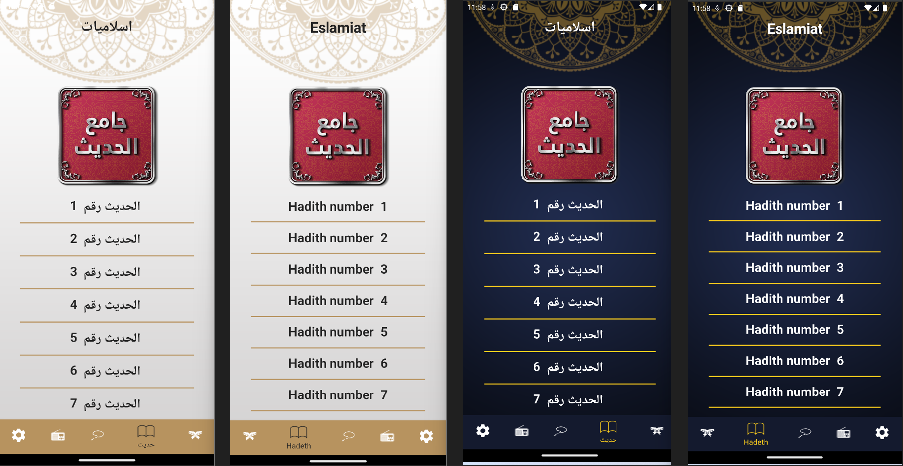
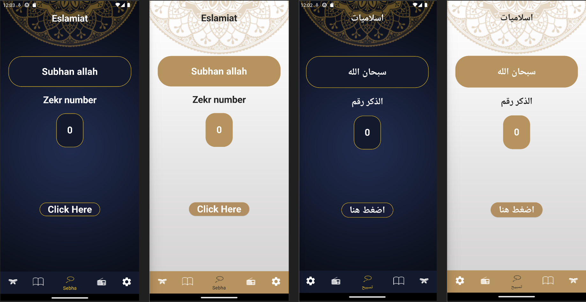

# Islamiat Mobile Application

## Overview
Islamiat is a mobile application designed to provide users with a comprehensive Islamic resource, offering features such as Quran Surahs listing and viewing, a collection of 50 Hadiths, and a digital Sebha for counting Tasbih. The application also supports both light and dark themes for user convenience.
## Technologies
1- uses Provider package to handle state management
2- uses shared preferences as data base to save theme and language data
3- read data from files that uses asynchronous programming

## Features

### 1. Quran Surahs Listing and Viewing
- **Surah List**: Browse through a complete list of all 114 Surahs.
  
- **Surah Details**: View the text of each Surah in Arabic.
  
- 
### 2. Hadith Collection
- **Hadith List**: Access a curated list of 50 significant Hadiths.
  
- **Hadith Details**: Read the full text of each Hadith in Arabic and English.
  

### 3. Digital Sebha
- **Tasbih Counting**: Count your Tasbih digitally with an easy-to-use interface.
  
### 4. provide localization
- **localization Support**: Toggle between Arabic and English languages.
### 5. provide Theming
- **Theme Support**: Toggle between light and dark themes for optimal viewing comfort.

## Usage

### Navigating the App
- **Home Screen**: Provides quick access to the main features: Quran, Hadith, and Sebha.
- **Navigation Bar**: Use the navigation bar at the bottom to switch between features.

### Enabling Themes
- **Light Theme**: Default theme for the app, suitable for well-lit environments.
- **Dark Theme**: Ideal for low-light conditions, can be enabled in the settings menu.

## Contributing
We welcome contributions from the community. To contribute:

1. Fork the repository.
2. Create a new branch (`git checkout -b feature/YourFeature`).
3. Commit your changes (`git commit -m 'Add some feature'`).
4. Push to the branch (`git push origin feature/YourFeature`).
5. Open a pull request.

## License
This project is licensed under the MIT License. See the LICENSE file for more details.

## Contact
For support or inquiries, please contact us at [Youssef.mohamed7557@gamil.com](Youssef.mohamed7557@gamil.com).

---

Thank you for using Islamiat! May it be a beneficial tool for your spiritual journey.